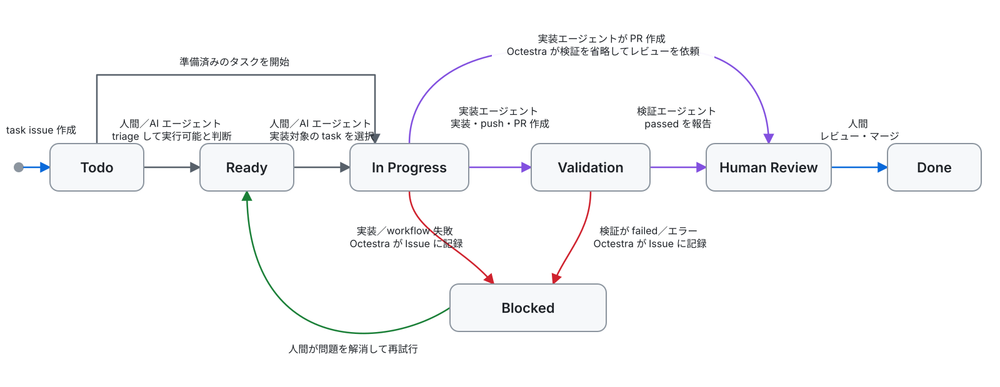

# Octestra

**Serverless AI agent orchestration framework built on top of GitHub**

<p align="center">

</p>

Octestra は、GitHub Issue を起点に、AI エージェントによるタスクの実装、プルリクエスト作成、検証までを GitHub Actions 上で実行するフレームワークです。organization の Issue Field で task issue の進行を管理し、人間によるレビューとマージまでの流れを支援します。

📖 [English](README.md) · [実装ガイド](docs/integration.ja.md)

各ノードは task issue の `AI Task Status`、矢印は次の status へ進める操作を表します。



## はじめに

### 必要なもの

- GitHub organization に属するリポジトリ
  - private repository であり、コーディングエージェントを実行するメンバーを信頼できること
  - インストール時にカスタム Issue Field を作成できる organization 管理者権限
- 対象リポジトリに対して認証済みの [GitHub CLI](https://cli.github.com/)
- 対象リポジトリにインストールされた、**Contents**、**Issues**、**Pull requests** への書き込み権限を持つ GitHub App
- GitHub Actions 上で実行できるコーディングエージェント

### インストール

Octestra を利用するリポジトリのルートディレクトリでインストーラを実行します。

```sh
curl -fsSL https://raw.githubusercontent.com/ainame/octestra/refs/heads/main/install.sh | bash
```

インストーラは次のファイルを追加します。

- Octestra 専用のファイル
  - `.github/octestra/octestra.sh`
  - `.github/octestra/config.yml`
  - `.github/octestra/issue-templates/epic.md.hbs`
  - `.github/octestra/issue-templates/task.md.hbs`
  - `.github/octestra/prompts/lifecycle-in-progress.md.hbs`
  - `.github/octestra/prompts/lifecycle-validation.md.hbs`
  - `.github/octestra/prompts/loop-todo.md.hbs`
  - `.github/octestra/actions/task-agent/action.yml`
  - `.github/octestra/actions/validation-agent/action.yml`
  - `.github/octestra/actions/triage-agent/action.yml`
- workflow
  - `.github/workflows/octestra-lifecycle.yml`
  - `.github/workflows/octestra-loop-todo.yml`
- エージェントスキル
  - `.agents/skills/octestra-setup-migration-epic/SKILL.md`
  - `.agents/skills/octestra-setup-migration-epic/scripts/setup_epic.rb`
  - `.agents/skills/octestra/SKILL.md`
  - `.agents/skills/octestra/scripts/check-output.sh`

### エージェントを設定する

インストール直後の agent action には、エージェントを実行するためのプレースホルダーがあります。まず [実装ガイド](docs/integration.ja.md) に従い、実装エージェントと検証エージェントを設定してください。

### 最初のタスクを実行する

1. EPIC issue とその sub-issue である task issue を、インストールされた issue-body contract から作成します。
2. task issue の `AI Task Status` を `Ready` に変更します。
3. 実装を開始するには `In Progress` に変更します。
4. Octestra がプルリクエストを作成し、検証後に `Human Review` へ進めます。

EPIC と task issue の書式、各 status option の意味、エージェントへの入力は [実装ガイド](docs/integration.ja.md) を参照してください。

### Todo Triage Loop を設定する

`.github/workflows/octestra-loop-todo.yml` は Todo triage agent を手動実行できます。
`.github/octestra/prompts/loop-todo.md.hbs` と
`.github/octestra/actions/triage-agent/action.yml` をカスタマイズしてください。

EPIC issue の `triage_skill` と、必要に応じて `epic-triage-prompt` block を設定してください。
描画された prompt では `triageSkill` と `epicTriagePrompt` として参照できます。open な
`octestra-epic` issue はデフォルトで対象になり、除外する EPIC は `skip_triage: true` を
設定します。Octestra は対象 EPIC ごとに bounded matrix job を起動します。repository skill は
task の探索、選択、件数制限、readiness policy と必要な issue preparation を所有しますが、
`AI Task Status` を直接変更してはいけません。完全に処理した task だけを報告し、Octestra が
結果を検証して対象となる Todo task を Ready に移動します。定期実行は opt-in です。実行間隔を設定し、workflow の
`schedule` block を uncomment してください。
実行前に、open なすべての `octestra-epic` issue で `triage_skill` を設定するか opt-out して
ください。不正な EPIC を黙って除外せず、discovery は明示的に失敗します。

## 更新とメンテナンス

```sh
.github/octestra/octestra.sh doctor
.github/octestra/octestra.sh vars check
.github/octestra/octestra.sh vars sync
.github/octestra/octestra.sh ref
.github/octestra/octestra.sh update --latest
```

| コマンド          | 用途                                                                  |
|-------------------|-----------------------------------------------------------------------|
| `doctor`          | 設定、status option、プロンプト、ワークフローの問題を報告             |
| `vars check`      | リポジトリの Actions 変数が `config.yml` と一致するか確認             |
| `vars sync`       | `config.yml` の必要な値を Actions 変数へコピー                        |
| `ref`             | インストール済みワークフローが使う Octestra のリポジトリと ref を表示 |
| `update --latest` | agent action と `config.yml` を保ったまま最新リリースをインストール |

インストーラを再実行すると lifecycle workflow は置き換えられます。`config.yml`、すべての
local agent action、loop workflow とその prompt は保持されます。更新後は、コミット前に
`git diff` で変更内容を確認してください。framework-owned の `/octestra` skill は置き換えられ、
古い `/octestra-validation-proof` skill は削除されます。triage finalization より前に作成した
インストールでは、保持される `octestra-loop-todo.yml` と `loop-todo.md.hbs` に現行 template の
result contract を手動で反映してください。

## セキュリティ

現在の Octestra は、**メンバーを信頼できるプライベートリポジトリ**を前提としています。

- `AI Task Status` Issue Field を変更できる人は、エージェントを開始できます。
- issue の本文を編集できる人は、エージェントへの指示を変更できます。
- エージェントには、リポジトリへの書き込み権限を持つ GitHub App トークンが渡されます。
- エージェントと、リポジトリへの書き込み権限を持つワークフローステップは、まだ別々のジョブに分離されていません。
- 検証結果は検証エージェント自身の主張であり、Octestra が独立して確認するものではありません。

Octestra は各ワークフローで指定された secret だけを渡し、リポジトリや organization のすべての secret をまとめて渡すことはありません。ただし、エージェントはリポジトリや issue を更新できるステップと同じジョブで動きます。public リポジトリや、信頼できない issue 入力には使用しないでください。

## 開発

```sh
npm ci
make all
```

`make all` は型チェックとテストを実行し、コミット対象の `dist/index.js` バンドルを再生成します。

Octestra を変更する前に [`AGENTS.md`](AGENTS.md) を読んでください。アーキテクチャ上の判断は [`docs/design.md`](docs/design.md)、今後の作業は [`TODO.md`](TODO.md) に記録されています。

## ライセンス

[MIT](LICENSE)
