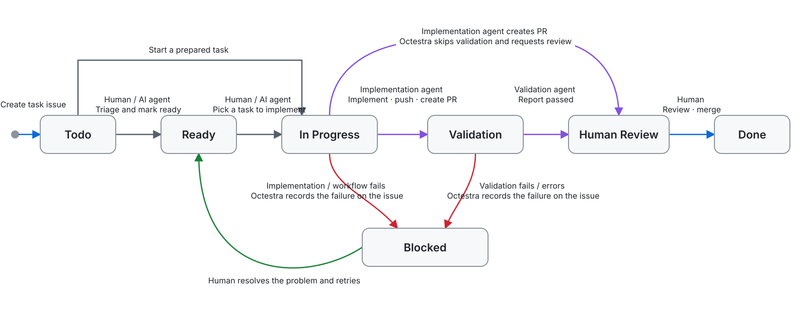

# Octestra

**Serverless AI agent orchestration framework built on top of GitHub**

<p align="center">

</p>

Octestra is a framework that uses GitHub Issues to run AI agents for task implementation, pull request creation, and validation on GitHub Actions. It manages the progress of task issues with an organization Issue Field and supports the flow through human review and merging.

📖 [日本語](README.ja.md) · [Integration guide](docs/integration.md)

Each node represents the `AI Task Status` of a task issue; each arrow represents an operation that moves it to the next status.



## Getting Started

### Requirements

- A repository in a GitHub organization
  - Organization administrator permission to create a custom Issue Field during installation
- [GitHub CLI](https://cli.github.com/) authenticated for the target repository
- A GitHub App installed on the target repository with write access to **Contents**, **Issues**, and **Pull requests**
- A coding agent that can run on GitHub Actions

### Install

Run the installer from the root directory of the repository that will use Octestra.

```sh
curl -fsSL https://raw.githubusercontent.com/ainame/octestra/refs/heads/main/install.sh | bash
```

The installer adds the following files.

- Files specific to Octestra
  - `.github/octestra/octestra.sh`
  - `.github/octestra/config.yml`
  - `.github/octestra/check-validation-result.sh`
  - `.github/octestra/issue-templates/epic.md.hbs`
  - `.github/octestra/issue-templates/task.md.hbs`
  - `.github/octestra/prompts/lifecycle-in-progress.md.hbs`
  - `.github/octestra/prompts/lifecycle-validation.md.hbs`
- Workflow templates
  - `.github/workflows/octestra-lifecycle.yml`
  - `.github/workflows/octestra-lifecycle-in-progress.yml`
  - `.github/workflows/octestra-lifecycle-validation.yml`
- Task setup skill
  - `.agents/skills/setup-migration-epic/SKILL.md`
  - `.agents/skills/setup-migration-epic/setup_epic.rb`

### Configure an Agent

The installed workflows contain placeholders for running agents. Configure an implementation agent and validation agent by following the [integration guide](docs/integration.md).

### Run Your First Task

1. Create an EPIC issue and its task issue sub-issues from the installed issue-body contracts.
2. Change the task issue's `AI Task Status` to `Ready`.
3. Change it to `In Progress` to begin implementation.
4. Octestra creates a pull request and moves the task to `Human Review` after validation.

For the EPIC and task issue format, the meaning of each status option, and agent inputs, see the [integration guide](docs/integration.md).

## Updating and Maintenance

```sh
.github/octestra/octestra.sh doctor
.github/octestra/octestra.sh vars check
.github/octestra/octestra.sh vars sync
.github/octestra/octestra.sh ref
.github/octestra/octestra.sh update --latest
```

| Command           | Purpose                                                                    |
|-------------------|----------------------------------------------------------------------------|
| `doctor`          | Report problems with configuration, status options, prompts, and workflows |
| `vars check`      | Check whether the repository's Actions variables match `config.yml`        |
| `vars sync`       | Copy the required values from `config.yml` to Actions variables            |
| `ref`             | Show the Octestra repository and ref used by installed workflows           |
| `update --latest` | Install the latest release while preserving agent actions and `config.yml` |

Rerunning the installer replaces workflows and keeps `config.yml` and both agent actions. Review
`git diff` before committing changes from an update.

## Security

Octestra currently assumes a **private repository with trusted members**.

- Anyone who can change the `AI Task Status` Issue Field can start an agent.
- Anyone who can edit an issue body can change the agent's instructions.
- The agent receives a GitHub App token with repository write access.
- The agent and the workflow steps with repository write access are not yet isolated into separate jobs.
- A validation result is the validation agent's claim; Octestra does not independently verify it.

Octestra passes only the secrets named in each workflow and never passes every repository or organization secret at once. However, the agent still runs in the same job as steps that can update the repository and its issues. Do not use Octestra for public repositories or untrusted issue input.

## Development

```sh
npm ci
make all
```

`make all` type-checks, runs tests, and rebuilds the committed `dist/index.js` bundle.

Read [`AGENTS.md`](AGENTS.md) before changing Octestra. Architecture decisions are documented in [`docs/design.md`](docs/design.md), and planned work is tracked in [`TODO.md`](TODO.md).

## License

[MIT](LICENSE)
